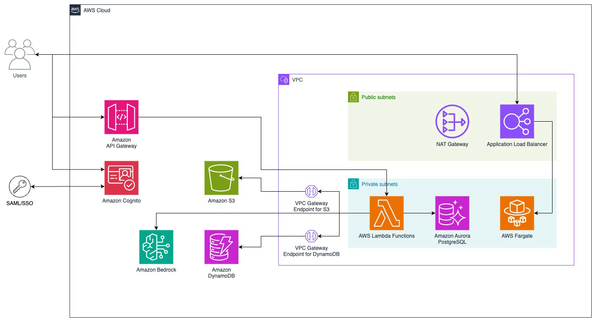

# aws-deploy-project-amplify
Freelance project for deploying amplify-genai to aws production environment of a customer.
Since its canceled and not active anymore, the secrets are no longer active, so I made the repo public :D.
The original repo: https://github.com/gaiin-platform

Here is the updated architecture by amplify-genai:

